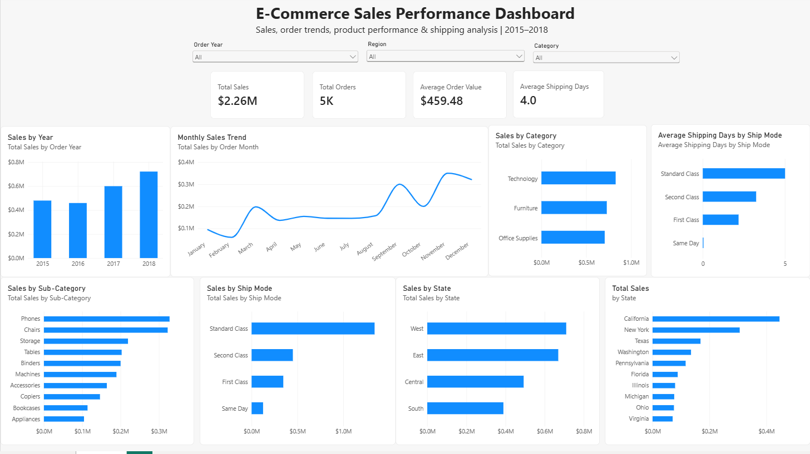

# E-Commerce Sales & Operations Analytics Dashboard


An interactive **Power BI dashboard** built to analyze e-commerce sales performance, product performance, regional sales, order trends, and shipping operations from 2015–2018.

The project demonstrates practical skills in **Power Query, DAX, data transformation, KPI development, interactive filtering, and business-oriented data visualization.**

---

## 📊 Dashboard Preview




## 🎯 Project Objective

The objective of this project was to transform raw e-commerce transaction data into an interactive business intelligence dashboard that allows users to quickly understand:

- Overall sales performance
- Sales trends over time
- Product category performance
- Regional and state-level sales
- Shipping method performance
- Average shipping time
- Order volume and average order value

The dashboard was designed from a business-user perspective rather than simply creating individual charts.

---

## 🛠️ Tools & Technologies

| Tool | Purpose |
|---|---|
| **Power BI Desktop** | Dashboard development and visualization |
| **Power Query** | Data cleaning and transformation |
| **DAX** | KPI calculations and analytical measures |
| **CSV** | Source dataset |
| **GitHub** | Project documentation and portfolio |

---

# 🔄 Data Preparation

The raw CSV data was imported into Power BI and transformed using **Power Query**.

### Transformations performed

- Reviewed and cleaned the source dataset
- Corrected column data types
- Created `Order Year`
- Created `Order Quarter`
- Created `Order Month`
- Created `Order Month Number`
- Created `Shipping Days`
- Configured month sorting using `Order Month Number`

### Shipping Days Calculation

Shipping time was calculated using:

```powerquery
Duration.Days([Ship Date] - [Order Date])

```powerquery
Duration.Days([Ship Date] - [Order Date])
